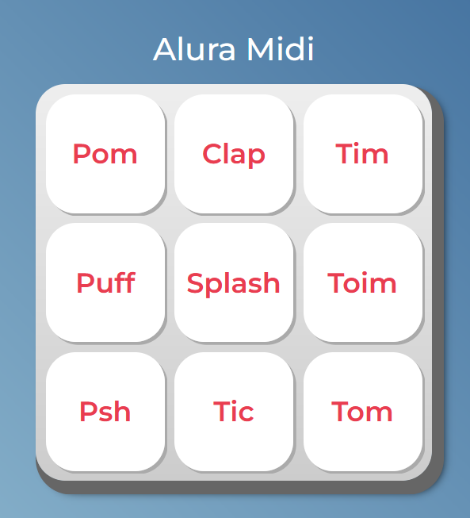

## 🎶 Alura Midi

O **Alura Midi** é uma aplicação interativa desenvolvida com **HTML, CSS e JavaScript**, que simula um **teclado musical com 9 sons diferentes** (como pom, clap, tim...). Cada botão representa um som, e ao clicar ou pressionar a tecla correspondente, o som é reproduzido dinamicamente na tela.

 

## 🚀 Sobre o Projeto

Este projeto foi desenvolvido durante o curso da Alura:

* "JavaScript para Web: Crie páginas dinâmicas"

Com o **Alura Midi**, aprendi como manipular o **DOM com JavaScript** para associar eventos e sons a elementos HTML. O projeto foi ideal para entender a comunicação entre **HTML, CSS e JS**, além de aplicar conceitos básicos de lógica de programação.

## 📚 Objetivos do Curso

* Identificar os papéis de cada tecnologia da Web para construção de páginas;
* Associar o JavaScript com HTML através do DOM;
* Implementar funções com JavaScript;
* Investigar possibilidades de resolução de problemas de código;
* Selecionar operadores lógicos adequados para diferentes situações;
* Produzir soluções simples para páginas dinâmicas.

## 🛠️ Tecnologias Utilizadas

## 🖼️ Visualização do Projeto

Uma prévia das principais funcionalidades do **Alura Midi**:

**🌐 Acesse o Projeto Online**

O projeto está disponível para visualização na **Vercel**. Clique no link abaixo para acessar:

**🎛️ Teclado de Sons**

Interface principal com 9 botões estilizados, cada um reproduz um som ao ser clicado.

